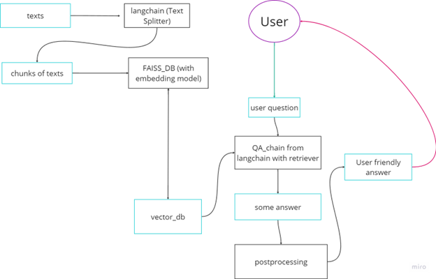

# Документация

1. Для разделения текста на чанки используется **RecursiveCharacterTextSplitter** ([ссылка](https://dev.to/eteimz/understanding-langchains-recursivecharactertextsplitter-2846)) из библиотеки **langchain**.

2. В качестве векторной базы данных выбрана **FIASS**, для векторизации используется open source embedding model от **Hugging Face** (`sentence-transformers/all-MiniLM-L6-v2`).

3. Используем модуль **RetrievalQA** из библиотеки **langchain**, передавая туда:  
    a. `llm` (`mistralai/Mistral-7B-Instruct-v0.1`)  
    b. `Retriever` из полученной на предыдущем шаге базы данных  
    c. `prompt` (`<s>[INST] {question}\n{context} [/INST]`)  

4. Получаем ответ, и после постпроцессинга отдаем его пользователю.

## Структура проекта

Поднимается локальный сервер с моделью, в API реализован единственный метод `/predict` (принимающий вопрос пользователя и возвращающий ответ). В качестве интерфейса используется **Telegram-бот**.

